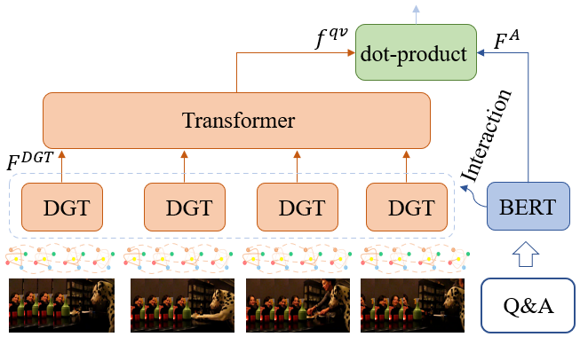
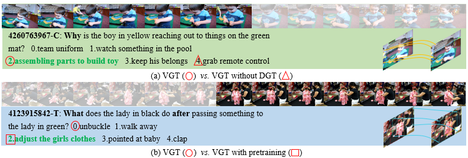

# [VGT](https://arxiv.org/abs/2207.05342)
This is the pytorch implementation of our paper accepted to ECCV'22: Video Graph Transformer for Video Question Answering.
See our [poster](https://doc-doc.github.io/docs/VGT-ECCV22-poster.pdf) for a quick overview of the work

<!--  -->
<div align="center">
  
</div>

## Todo
1. [x] Release feature of TGIF-QA + MSRVTT-QA [temporally access].

## Environment
Assume you have installed Anaconda, please do the following to setup the envs:
```
>conda create -n videoqa python==3.8.8
>conda activate videoqa
>git clone https://github.com/sail-sg/VGT.git
>pip install -r requirements.txt
```
## Preparation
Please create a data folder outside this repo, so you have two folders in your workspace 'workspace/data/' and 'workspace/VGT/'. 

Below we use NExT-QA as an example to get you farmiliar with the code. 
Please download the related video feature and QA annotations according to the links provided in the ```Results and Resources``` section. Extract QA annotations into ```workspace/data/datasets/nextqa/```, video features into ```workspace/data/feats/nextqa/``` and checkpoint files into ```workspace/data/save_models/nextqa/```.


## Inference
```
./shell/next_test.sh 0
```
## Evaluation
```
python eval_next.py --folder VGT --mode val
``` 

## Results and Resources
**<p align="center">Table 1. VideoQA Accuracy (%).</p>**
<table>
  <tr>
    <th>Cross-Modal Pretrain</th>
    <th><a href="https://github.com/doc-doc/NExT-QA", target="_blank">NExT-QA</a></th>
    <th><a href="https://github.com/YunseokJANG/tgif-qa", target="_blank">TGIF-QA</a> (Action)</th>
    <th>TGIF-QA (Trans)</th>
    <th>TGIF-QA (FrameQA)</th>
    <th>TGIF-QA-R* (Action)</th>
    <th>TGIF-QA-R* (Trans)</th>
    <th><a href="https://github.com/xudejing/video-question-answering">MSRVTT-QA</a></th>
  </tr>
  <tr>
    <td>-</td>
    <td>53.7</td>
    <td>95.0</td>
    <td>97.6</td>
    <td>61.6</td>
    <td>59.9</td>
    <td>70.5</td>
    <td>39.7</td>
  </tr>
  
  <tr>
    <td><a href="https://drive.google.com/file/d/1xvKFUHGrRz8gtv2jPE-2T4ug89fyX7zO/view?usp=sharing">WebVid0.18M</a></td>
    <td><a href="https://drive.google.com/file/d/1N7nDGS8x3lKbmcADZ-qWBYCpPTEK6YEC/view?usp=sharing">55.7<a></td>
    <td>-</td>
    <td>-</td>
    <td>-</td>
    <td>60.5</td>
    <td>71.5</td>
    <td>-</td>
  </tr>
  <tr>
   <td>-</td>
    <td><a href="https://drive.google.com/file/d/19TRupHHAP9m0eE9n3b2HMcliiJE9VGcN/view?usp=sharing">feats</a></td>
    <td>feats</td>
    <td><a href="https://drive.google.com/file/d/1WmUdVLyY9GjdUg5SH5W0wrekdrRKlO19/view?usp=sharing">feats</a></td>
    <td>feats</td>
     <td><a href="https://drive.google.com/file/d/11ka3AyaZIP2kLeKboyvYlRsCLSors5Ov/view?usp=sharing">feats</a></td>
    <td><a href="https://drive.google.com/file/d/1WmUdVLyY9GjdUg5SH5W0wrekdrRKlO19/view?usp=sharing">feats</a></td>
    <td><a href="https://drive.google.com/file/d/14efO-eeYFSKKPhhG3AUqJLOONm80xDo8/view?usp=sharing">feats</a></td>
  </tr>
  <tr>
    <td>-</td>
    <td><a href="https://xdshang.github.io/docs/vidor.html">train&val</a>+<a href="https://drive.google.com/file/d/12WCsaOOlDQNaXILSxvL-hIM3TxV15dV3/view?usp=sharing">test</a></td>
    <td>videos</td>
    <td>videos</td>
    <td>videos</td>
    <td>videos</td>
    <td>videos</td>
    <td>videos</td>
  </tr>
  <tr>
    <td>-</td>
    <td><a href="https://drive.google.com/file/d/1DS1nof3lhq5QiWRrvOTiN436_ca4EN2Y/view?usp=sharing">Q&A</a></td>
    <td><a href="https://drive.google.com/file/d/1CE04mDGiQ2EcG5zbQAgERi-EukiIPKSw/view?usp=sharing">Q&A</a></td>
    <td>Q&A</td>
    <td>Q&A</td>
    <td><a href="https://drive.google.com/file/d/1arKsPSkx9DwlX1SpP_qoh30PgfgitKQv/view?usp=sharing">Q&A</a></td>
    <td>Q&A</td>
    <td><a href="https://drive.google.com/file/d/1vstHqtgZQBkPzzRTZo-Nb15rAQ4b7gOl/view?usp=sharing">Q&A</a></td>
  </tr>
</table>
(We have merged some files of the same dataset to avoid too many links.)

## Train
We have provided all the scripts in the folder 'shells', you can start your training by specifying the GPU IDs behind the script. (If you have multiple GPUs, you can separate them with comma: ./shell/nextqa_train.sh 0,1)
```
./shell/nextqa_train.sh 0
```
It will train the model and save to the folder 'save_models/nextqa/'

### Result Visualization (NExT-QA)
<div align="center">
  
</div>

## Citation 
```
@article{xiao2022video,
	  title={Video Graph Transformer for Video Question Answering},
	  author={Xiao, Junbin and Zhou, Pan and Chua, Tat-Seng and Yan, Shuicheng},
	  journal={arXiv preprint arXiv:2207.05342},
	  year={2022}
}
```
## Acknowledgements
Some code are token from [VQA-T](https://github.com/antoyang/just-ask). Thanks the auhtors for their great work and code.
## Notes
If you use any resources (feature & code & models) from this repo, please kindly cite our paper and acknowledge the source.
## License
This repository is released under the Apache 2.0 license as found in the [LICENSE](LICENSE) file.
